<div align="center">

# ⚡ Veridag

### **The Deterministic Distributed Trust Fabric for AI Agents, Edge Swarms, and Enterprise State**

[](https://github.com/Hardonian/veridag/releases)
[](https://www.rust-lang.org)
[](implementations/rust/Cargo.toml)
[](formal/quint/)
[](LICENSE-APACHE)
[](implementations/rust/crates/net)
[](implementations/rust/crates/storage)
[](#footprint--performance)

<p align="center">
  <a href="#-quickstart-in-under-3-minutes">Quickstart</a> •
  <a href="#-why-veridag">Why Veridag</a> •
  <a href="#-key-capabilities">Key Capabilities</a> •
  <a href="#-architecture--dataflow">Architecture</a> •
  <a href="#-target-use-cases">Use Cases</a> •
  <a href="#-comparison">Comparison</a> •
  <a href="#-crate-ecosystem">Crate Map</a> •
  <a href="https://github.com/Hardonian/veridag/tree/main/docs">Docs</a>
</p>

---

</div>

## 🌐 What is Veridag?

**Veridag** is an implementation-independent protocol and ultra-lightweight Rust engine for **deterministic, Byzantine-resilient, capability-secured distributed computation**.

It gives mutually distrustful parties—autonomous AI agents, organizations, microservices, cloud nodes, and edge devices—a shared, tamper-proof state machine that guarantees exact mathematical agreement without centralized coordinators.

```
┌────────────────┐     ┌────────────────┐     ┌────────────────┐
│   Consensus    │  +  │   Verifiable   │  +  │ Deterministic  │
│  (DAG-BFT)     │     │     State      │     │  Computation   │
└───────┬────────┘     └───────┬────────┘     └───────┬────────┘
        │                      │                      │
        ▼                      ▼                      ▼
┌────────────────┐     ┌────────────────┐     ┌────────────────┐
│   Capability   │  +  │      Data      │  +  │ Cryptographic  │
│    Security    │     │  Availability  │     │     Proofs     │
└───────┬────────┘     └───────┬────────┘     └───────┬────────┘
        │                      │                      │
        └──────────────────────┼──────────────────────┘
                               │
                               ▼
        ================================================
        🛡️   V E R I D A G   T R U S T   F A B R I C   🛡️
        ================================================
```

### What Veridag Is NOT
* ❌ **Not a speculative cryptocurrency or token casino** — No gas volatility, no tokens required to run consensus.
* ❌ **Not a bloated blockchain clone** — No 500GB ledger bloat, no complex node mining rigs.
* ❌ **Not a fragile cloud framework** — Zero runtime dependencies; no Kubernetes, Postgres, Redis, or Kafka sidecars needed.

---

## ⚡ Why Veridag?

| Property | What It Means for You |
| :--- | :--- |
| **Pure-Function DAG-BFT** | Consensus is an invariant pure function over a causal DAG. Given identical inputs, every node resolves the identical commit point and wave ordering. |
| **Zero-Unsafe Core** | The entire consensus, execution, and state engine enforces `#![forbid(unsafe_code)]`. Memory safety vulnerabilities cannot corrupt state. |
| **Object-Centric Capabilities** | Fine-grained object capabilities replace blunt permissions. Access is scoped, verifiable, and strictly sandboxed. |
| **Instant Crash Recovery** | Append-friendly embedded `sled` storage. If a node crashes mid-commit, it reboots, replays durable bytes, and recovers byte-identical state. |
| **Sub-10MB Edge Footprint** | Statically linked binary with low energy and memory consumption. Runs identically on a developer laptop, cloud VM, or Raspberry Pi. |
| **Authenticated QUIC Fast Path** | Low-latency 1-RTT gossip over authenticated QUIC with self-signed Ed25519 TLS certificates and domain-separated preimages. |

---

## 🚀 Quickstart (In Under 3 Minutes)

### 1. Prerequisites
Veridag requires only standard **Rust 1.85+** (edition 2021):
```bash
# Install Rust via rustup (Linux, macOS, WSL2, Windows)
curl --proto '=https' --tlsv1.2 -sSf https://sh.rustup.rs | sh
rustup default stable
```

### 2. Clone & Build
```bash
git clone https://github.com/Hardonian/veridag.git
cd veridag
```

### 3. Run the In-Process 4-Validator Consensus Demo
Witness 4 independent validator nodes reach cryptographic agreement on state roots and checkpoint IDs in a single command:

```bash
cargo run -p veridag-node -- demo
```

**Output:**
```text
veridag-node demo: 4-validator committee, in-process
submitted transfer alice->bob 40 to all mempools
round 1: max round reached 1
round 2: max round reached 2
...
round 9: max round reached 9
validator 0: state_root=0xf7aa17319c5c16538466bbba21d451cb0d7d4c82b9a7c3b999fb4eb8b22a0149 checkpoints=1
  checkpoint seq=1 id=0x2c0f6f0ba82cb46a9e223dcb44f9c6d480da39b56fce2685799a779140fa7812
validator 1: state_root=0xf7aa17319c5c16538466bbba21d451cb0d7d4c82b9a7c3b999fb4eb8b22a0149 checkpoints=1
validator 2: state_root=0xf7aa17319c5c16538466bbba21d451cb0d7d4c82b9a7c3b999fb4eb8b22a0149 checkpoints=1
validator 3: state_root=0xf7aa17319c5c16538466bbba21d451cb0d7d4c82b9a7c3b999fb4eb8b22a0149 checkpoints=1
AGREEMENT OK: identical state root across 4 validators
bob balance: 40 (expected 40)
```

### 4. Run the Real Multi-Process QUIC Devnet Test
Spin up 4 distinct OS processes communicating over live authenticated QUIC sockets:
```bash
cargo test -p veridag-net --test devnet -- --nocapture
```

### 5. Verify Crash-Safety & Recovery
Verify restart consistency: drop all in-memory state, rebuild from disk, and assert bit-for-bit identical state roots:
```bash
cargo test -p veridag-storage --features persistent
```

---

## 🎯 Target Use Cases

```
  ┌────────────────────────────────────────────────────────────────────────┐
  │                           VERIDAG USE CASES                            │
  ├───────────────────┬────────────────────┬───────────────────────────────┤
  │ 🤖 AI Agent       │ 🏭 Cross-Org       │ 📡 Edge & IoT                 │
  │    Swarms         │    Settlement      │    Mesh Nodes                 │
  │                   │                    │                               │
  │ Cryptographically │ Multi-party        │ Zero-coordinator              │
  │ verifiable multi- │ auditable workflow │ Byzantine agreement           │
  │ agent task audit  │ without vendor     │ running on battery /          │
  │ & capabilities.   │ lock-in.           │ constrained SBCs.             │
  └───────────────────┴────────────────────┴───────────────────────────────┘
```

### 1. 🤖 Autonomous AI Agent Trust Fabrics
When multiple autonomous LLM agents collaborate on critical tasks (financial transactions, code deployment, automated purchasing), Veridag provides a verifiable execution log, preventing prompt injection equivocation, replaying attacks, or malicious state tampering.

### 2. 🏭 Cross-Enterprise Audit & Settlement
Companies collaborating on supply chain, logistics, or data sharing can run Veridag validator nodes across disparate cloud providers (AWS, GCP, Azure, On-Prem). No single entity owns the database; all transactions are cryptographically proven.

### 3. 📡 Edge & IoT Resilient Meshes
Connected vehicles, smart grid devices, and remote telemetry stations can form local peer-to-peer DAG committees over QUIC. Even during WAN disconnections, local clusters achieve verifiable consensus and merge back safely upon reconnection.

---

## 📊 Comparison Matrix

| Feature | Veridag | Blockchains (Ethereum / Solana) | Traditional BFT (Raft / Paxos) | Message Queues (Kafka / NATS) |
| :--- | :---: | :---: | :---: | :---: |
| **Byzantine Fault Tolerant ($3f+1$)** | ✅ Yes | ✅ Yes | ❌ Crash-Fault Only ($2f+1$) | ❌ No |
| **Deterministic State Roots** | ✅ BMH-1 Merkle | ✅ Variable | ❌ No State Roots | ❌ No State Roots |
| **No Crypto Tokens Required** | ✅ Free / Neutral | ❌ Heavy Gas Costs | ✅ Free | ✅ Free |
| **Embedded Zero-Config Database** | ✅ Built-in Sled | ❌ Heavy Custom DB | ⚠️ Varies | ❌ Heavy Cluster |
| **Network Protocol** | ✅ QUIC + TLS 1.3 | ⚠️ Custom P2P / TCP | ⚠️ TCP / gRPC | ⚠️ TCP |
| **Formal Model Checked** | ✅ Quint (Level 2) | ⚠️ Partial | ⚠️ Partial | ❌ No |
| **Static Binary Footprint** | ✅ < 10MB | ❌ Multiple Gigabytes | ⚠️ 50–200MB | ❌ JVM / Multi-node |

---

## 🏗️ Architecture & Dataflow

```mermaid
flowchart LR
    subgraph Ingestion
        A[Client Tx] --> B[Validation Pipeline]
        B --> C[VCE-1 Batch Commitment]
    end

    subgraph DAG & Gossip
        C --> D[Signed DAG Vertex]
        D --> E[QUIC Gossip Network]
    end

    subgraph Consensus & Execution
        E --> F[BaselineDagBft Pure Commit]
        F --> G[Canonical Wave Ordering]
        G --> H[Conflict-Aware Executor]
    end

    subgraph State & Durability
        H --> I[BMH-1 Merkle Root]
        I --> J[Quorum Checkpoint]
        J --> K[(Sled Storage DB)]
    end

    classDef primary fill:#111722,stroke:#4ade80,stroke-width:2px,color:#e6edf3;
    classDef secondary fill:#0a0e14,stroke:#38bdf8,stroke-width:1px,color:#8b9bb0;
    class A,B,C,D,E,F,G,H,I,J,K primary;
```



### 3-Level Verification Hierarchy
Every piece of Veridag is governed by a strict hierarchy of authority:

| Level | Artifact | Path | Purpose |
| :---: | :--- | :--- | :--- |
| **Level 1** | **Normative Protocol Specification** | [`protocol/specification/`](protocol/specification/) | Mathematical definitions, wire schemas, state rules |
| **Level 2** | **Formal Executable Model** | [`formal/quint/`](formal/quint/) | Quint model checking: Agreement, Finality, and Integrity |
| **Level 3** | **Reference Implementation** | [`implementations/rust/`](implementations/rust/) | High-performance, zero-unsafe Rust engine |

---

## 📦 Crate Ecosystem

The Rust reference implementation is split into decoupled, reusable, modular crates:

```
implementations/rust/crates/
├── protocol-types/     # Canonical IDs, hash types, version tags
├── codec/              # VCE-1 canonical encoder/decoder
├── crypto/             # BLAKE3, Ed25519, domain-separated preimages
├── merkle/             # BMH-1 Merkle trees & inclusion proofs
├── transaction/        # Transaction model & replay prevention
├── capabilities/       # Capability objects and scoped authorization
├── object-state/       # Version-disciplined object store
├── dag/                # VCE-1 DAG structure, equivocation detection
├── consensus/          # BaselineDagBft pure commit rule & wave ordering
├── execution/          # Sequential oracle & parallel conflict scheduler
├── checkpoint/         # Quorum finality proofs (2f+1)
├── storage/            # Sled persistent & in-memory storage backends
├── net/                # QUIC authenticated validator transport
├── metrics/            # Zero-overhead telemetry probes
└── testkit/            # Golden vector suite & malformed fuzz tests
```

---

## 🧰 Developer Cheatsheet

Veridag includes a rich `justfile` and `Makefile` for developer ergonomics:

```bash
# Setup & Linting
just setup             # Install rustfmt, clippy, toolchain helpers
just check             # Format check, zero-warning clippy gate, full test suite

# Execution & Demos
just demo              # Run the in-process 4-node consensus demo
just devnet            # Run the 4-node QUIC live socket devnet
just sim               # Run the deterministic simulation harness
just health            # Run node health probe & output JSON verification

# Protocol & Conformance
just vectors           # Regenerate and validate protocol test vectors
just formal            # Run Quint model checker across all invariants

# Web Portal
just site-dev          # Launch documentation & showcase Next.js app locally
just site-build        # Build static production web portal bundle
```

---

## 🔒 Security & Verification Invariants

Veridag enforces non-negotiable core invariants:
1. **Agreement:** Non-faulty nodes commit identical state anchors.
2. **Finality:** Committed waves are immutable and cannot be rolled back.
3. **Integrity:** Only validly signed, structurally sound vertices enter the DAG.
4. **Determinism:** State transitions are pure functions independent of machine architecture, memory layout, CPU count, or wall-clock timestamps.

For vulnerability disclosure and security policies, see [SECURITY.md](SECURITY.md).

---

## 📄 License

Dual-licensed under either of:
* Apache License, Version 2.0 ([LICENSE-APACHE](LICENSE-APACHE))
* MIT License ([LICENSE-MIT](LICENSE-MIT))

at your option.
