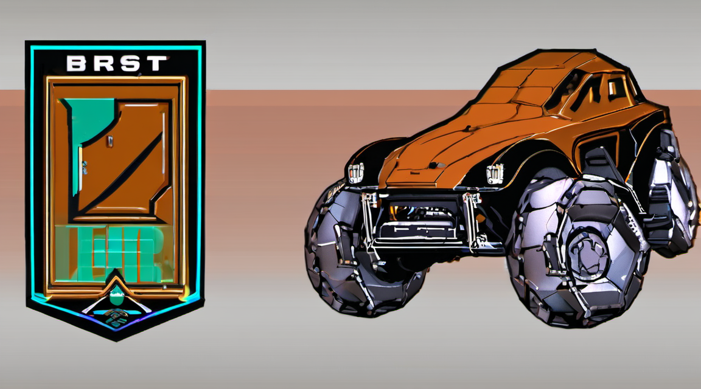

# ⚡ Veridag



## The Deterministic Distributed Trust Fabric for AI Agents, Edge Swarms, and Enterprise State

[](https://github.com/Hardonian/veridag/releases)
[](https://www.rust-lang.org)
[](implementations/rust/Cargo.toml)
[](formal/quint/)
[](LICENSE-APACHE)
[](implementations/rust/crates/net)
[](implementations/rust/crates/storage)
[](#why-veridag)

[Quickstart](#quickstart-in-under-3-minutes) • [Why Veridag](#why-veridag) • [Enterprise APIs](#enterprise-infrastructure--apis) • [SDKs](#multi-language-sdks) • [ISO 20022](#iso-20022-banking-bridge) • [SOC-2 & Security](#soc-2-type-ii--security) • [Crate Map](#crate-ecosystem) • [Docs](https://github.com/Hardonian/veridag/tree/main/docs)

---

## What is Veridag?

**Veridag** is an implementation-independent protocol and ultra-lightweight Rust engine for **deterministic, Byzantine-resilient, capability-secured distributed computation**.

It gives mutually distrustful parties—autonomous AI agents, organizations, microservices, cloud nodes, and edge devices—a shared, tamper-proof state machine that guarantees exact mathematical agreement without centralized coordinators.

```text
┌────────────────┐     ┌────────────────┐     ┌────────────────┐
│   Consensus    │  +  │   Verifiable   │  +  │ Deterministic  │
│  (DAG-BFT)     │     │     State      │     │  Computation   │
└───────┬────────┘     └───────┬────────┘     └───────┬────────┘
        │                      │                      │
        ▼                      ▼                      ▼
┌────────────────┐     ┌────────────────┐     ┌────────────────┐
│   Capability   │  +  │      Data      │  +  │ Cryptographic  │
│    Security    │     │  Availability  │     │     Proofs     │
└───────┬────────┘     └───────┬────────┘     └───────┬────────┘
        │                      │                      │
        └──────────────────────┼──────────────────────┘
                               │
                               ▼
        ================================================
        🛡️   V E R I D A G   T R U S T   F A B R I C   🛡️
        ================================================
```

### What Veridag Is NOT

- ❌ **Not a speculative cryptocurrency or token casino** — No gas volatility, no speculative hype tokens required to run consensus.
- ❌ **Not a bloated blockchain clone** — No 500GB ledger bloat, no complex node mining rigs.
- ❌ **Not a fragile cloud framework** — Zero runtime dependencies; no Kubernetes, Postgres, Redis, or Kafka sidecars needed.

### Flagship Institutional Capabilities

- 🏛️ **USDV (Veridag Dollar): USMCA & G8 Multilateral Settlement Substrate** — Engineered for USMCA cross-border trade corridors and G8 economic forum multilateral treasury settlement with strict US Treasury alignment. 100% reserve-backed (US Treasuries $\le 90$d, overnight reverse repo, FDIC cash deposits), cryptographically verified Proof of Reserves (PoR) in state roots, capability-gated mint/burn/pause, and real-time OFAC compliance sanctions screening.
- ⛓️ **Iron-Clad Ethereum Infrastructure** — Zero-reorg high-throughput L2 DAG sequencer, native EVM JSON-RPC (`eth_*`), trustless L1 Light Client verification ([`VeridagLightClient.sol`](contracts/VeridagLightClient.sol)), and two-way bridge portal ([`VeridagBridge.sol`](contracts/VeridagBridge.sol)).
- ⚡ **ISO 20022 Financial Messaging Mainframe** — Direct ingestion of institutional `pacs.008.001.08` XML wire transfers, automated 1 bps clearing surcharge distribution, and signed `pacs.002.001.10` status reports with cryptographic state root commitments.

---

## Why Veridag?

| Property | What It Means for You |
| :--- | :--- |
| **Pure-Function DAG-BFT** | Consensus is an invariant pure function over a causal DAG. Given identical inputs, every node resolves the identical commit point and wave ordering. |
| **Zero-Unsafe Core** | The entire consensus, execution, and state engine enforces `#![forbid(unsafe_code)]`. Memory safety vulnerabilities cannot corrupt state. |
| **Object-Centric Capabilities** | Fine-grained object capabilities replace blunt permissions. Access is scoped, verifiable, and strictly sandboxed. |
| **Instant Crash Recovery** | Append-friendly embedded `sled` storage. If a node crashes mid-commit, it reboots, replays durable bytes, and recovers byte-identical state. |
| **Sub-10MB Edge Footprint** | Statically linked binary with low energy and memory consumption. Runs identically on a developer laptop, cloud VM, or Raspberry Pi. |
| **Authenticated QUIC Fast Path** | Low-latency 1-RTT gossip over authenticated QUIC with self-signed Ed25519 TLS certificates and domain-separated preimages. |

---

## Quickstart (In Under 3 Minutes)

### 1. Prerequisites

Veridag requires standard **Rust 1.85+** (edition 2021):

```bash
curl --proto '=https' --tlsv1.2 -sSf https://sh.rustup.rs | sh
rustup default stable
```

### 2. Clone & Build

```bash
git clone https://github.com/Hardonian/veridag.git
cd veridag
```

### 3. Run the In-Process 4-Validator Consensus Demo

Witness 4 independent validator nodes reach cryptographic agreement on state roots and checkpoint IDs in a single command:

```bash
cargo run -p veridag-node -- demo
```

**Output:**

```text
veridag-node demo: 4-validator committee, in-process
submitted transfer alice->bob 40 to all mempools
round 1..11: max round reached 11
validator 0: state_root=0xac049e6fdadc2840ff5d3a9ee9e4598a4eebf86e68861bccedcab8f46942cb4e checkpoints=1
  checkpoint seq=1 id=0x3a875556df63e5ff02303aa0971018d2a69e3d1bd344b50cbb459b160daade40
...
AGREEMENT OK: identical state root across 4 validators
bob balance: 40 (expected 40)
```

---

## Enterprise Infrastructure & APIs

### Built-in HTTP / JSON-RPC Daemon

Launch the production validator node daemon with the embedded HTTP server:

```bash
# Launch validator node daemon with HTTP RPC enabled
cargo run -p veridag-node -- run --validator-seed 1 --rpc 0.0.0.0:8080

# Query node health
curl http://127.0.0.1:8080/v1/health

# Query cryptographic Sparse Merkle Tree state root
curl http://127.0.0.1:8080/v1/state/root

# Query latest finalized checkpoint certificate
curl http://127.0.0.1:8080/v1/checkpoints/latest
```

### Multi-Validator Docker Compose Mesh

Launch 4 independent validator nodes communicating over an authenticated QUIC mesh with mapped RPC ports:

```bash
docker compose up -d
curl http://localhost:8081/v1/health
```

---

## Multi-Language SDKs

Veridag maintains first-class, bit-for-bit conformant client libraries across Rust, TypeScript, and Python:

### TypeScript SDK (`@veridag/sdk`)

```typescript
import { VeridagClient, Keypair, TxBuilder } from "@veridag/sdk";

const client = new VeridagClient("http://127.0.0.1:8080");
const health = await client.health();
console.log("Connected to DAG:", health.status, "State Root:", health.state_root);

const sender = Keypair.fromSeed(new Uint8Array(32).fill(1));
const recipient = Keypair.fromSeed(new Uint8Array(32).fill(2)).address();
const stx = new TxBuilder(sender).nonce(0).transfer(recipient, 500n);
const receipt = await client.submitTransaction(stx, sender.public);
console.log("Tx admitted into DAG:", receipt.tx_id);
```

### Python SDK (`veridag`)

```python
from veridag import VeridagClient, Keypair, TxBuilder

client = VeridagClient("http://127.0.0.1:8080")
h = client.health()
print(f"Connected: chain={h['chain_id']} root={h['state_root'][:16]}...")

sender = Keypair.from_seed(b"\x01" * 32)
recipient = Keypair.from_seed(b"\x02" * 32).address()
stx = TxBuilder(sender).nonce(0).transfer(recipient, 500)
res = client.submit_transaction(stx, sender.public())
print("Tx admitted:", res["tx_id"])
```

---

## ISO 20022 Banking Bridge

Veridag provides native parsing and atomic DAG execution of ISO 20022 `pacs.008.001.08` credit transfer instructions with automatic 1 bps clearing surcharge splits (80% validator pool, 20% insurance reserve) and cryptographic `pacs.002.001.10` execution receipts:

```bash
cargo test -p veridag-stablecoin iso20022
```

---

## SOC-2 Type II & Security

Veridag maps strictly to **AICPA Trust Services Criteria** across:

- **CC6 Logical Access**: Ed25519 asymmetric signatures, domain separation tags, consortium multi-tenancy.
- **CC7 Operations**: Causal DAG audit log, SMT inclusion proofs, automated `/v1/health` monitoring.
- **A1 Availability**: Bullshark $3f+1$ Byzantine Fault Tolerance with asynchronous fallback.
- **PI1 Processing Integrity**: Canonical VCE-1 non-malleable encoding, metered WebAssembly runtime.
- **C1 Confidentiality**: TLS 1.3 / Noise transport encryption, zero hardcoded credentials.

For details, review [`compliance/SOC2_TYPE2_CONTROLS.md`](compliance/SOC2_TYPE2_CONTROLS.md) and the interactive 12-vector threat matrix at [`site/app/security/`](site/app/security/).

---

## Crate Ecosystem

```text
implementations/rust/
├── bins/
│   ├── veridag-node/       # Full Validator Daemon & HTTP/JSON RPC Server
│   ├── veridag-cli/        # Universal Operator & Developer CLI
│   └── veridag-genesis/    # Committee Genesis Bootstrap Tool
└── crates/
    ├── protocol-types/     # Canonical IDs, hash types, version tags
    ├── codec/              # VCE-1 canonical non-malleable binary codec
    ├── crypto/             # Ed25519, SHA-512/256 domain separation
    ├── merkle/             # Sparse Merkle Trees (SMT) & inclusion proofs
    ├── capabilities/       # Object-capability authorization tokens
    ├── transaction/        # Transaction wire format & replay protection
    ├── object-state/       # Version-disciplined object ledger
    ├── dag/                # DAG structure, equivocation detection
    ├── consensus/          # Bullshark DAG-BFT commit rule & wave ordering
    ├── execution/          # Conflict-aware parallel scheduler
    ├── checkpoint/         # Quorum finality proofs (2f+1)
    ├── wasm-runtime/       # Metered Wasmtime smart contract sandbox
    ├── zkvm/               # SP1 & RiscZero zero-knowledge adapters
    ├── da/                 # 2D Reed-Solomon data availability
    ├── light-client/       # Trustless light client verification
    ├── bitcoin/            # Bitcoin native SPV header & PoW client
    ├── ethereum/           # Ethereum L1 light client proofs & EVM JSON-RPC
    ├── stablecoin/         # USDV sovereign dollar, ISO 20022 engine & PoR
    ├── storage/            # Sled & redb durable persistence backends
    ├── net/                # Authenticated QUIC + TLS 1.3 mesh transport
    ├── sdk/                # Native Rust client SDK
    ├── metrics/            # Zero-overhead Prometheus probes
    └── testkit/            # Golden vectors & cross-language harness
```

---

## Developer Cheatsheet

```bash
# Setup & Linting
just check             # Format check, zero-warning clippy gate, full test suite

# Multi-Language SDK Conformance (Rust, TS, Python)
pwsh -File scripts/publish-sdks.ps1   # Windows PowerShell
bash scripts/publish-sdks.sh          # Linux / macOS

# Execution & Demos
cargo run -p veridag-node -- demo    # Run in-process 4-node consensus demo
docker compose up -d                 # Spin up 4-node container cluster

# Web Portal & Economics
just site-build        # Build Next.js documentation, explorer & pricing portal
```

---

## Security & Verification Invariants

Veridag enforces non-negotiable core invariants:

1. **Agreement:** Non-faulty nodes commit identical state anchors.
2. **Finality:** Committed waves are immutable and cannot be rolled back.
3. **Integrity:** Only validly signed, structurally sound vertices enter the DAG.
4. **Determinism:** State transitions are pure functions independent of machine architecture, memory layout, CPU count, or wall-clock timestamps.

For vulnerability disclosure and security policies, see [SECURITY.md](SECURITY.md).

---

## License

Dual-licensed under either of:

- Apache License, Version 2.0 ([LICENSE-APACHE](LICENSE-APACHE))
- MIT License ([LICENSE-MIT](LICENSE-MIT))

at your option.
