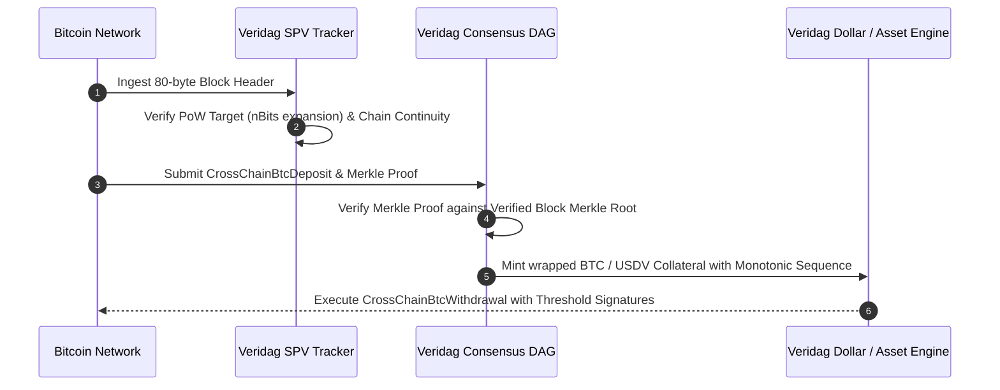

# Bitcoin Infrastructure Substrate

## Overview

Veridag integrates deep Bitcoin infrastructure capabilities directly into its sovereign consensus and execution substrate. Rather than relying on centralized custodial oracles or trusted federations, Veridag validators natively verify:

- **Bitcoin SPV Block Headers:** Continuous tracking and PoW validation of canonical 80-byte block headers.
- **Merkle Inclusion Proofs:** Verifying that a specific transaction `txid` is included within the block's `merkle_root` via Double-SHA256 (`hash256`).
- **Two-Way Cross-Chain Bridge Codecs:** Safe, deterministic UTXO deposit tracking and withdrawal settlement.
- **Bitcoin JSON-RPC Gateway:** Emulating standard Bitcoin RPC endpoints (`getblockcount`, `getblockhash`, `getblockheader`) for seamless integration with existing Bitcoin infrastructure.

---

## Architectural Workflow



---

## Technical Specifications

### Block Header Format (80 bytes)
- **Version:** 4 bytes, Little-Endian
- **Previous Block Hash:** 32 bytes, Little-Endian
- **Merkle Root:** 32 bytes, Little-Endian
- **Timestamp:** 4 bytes, Unix epoch
- **Bits:** 4 bytes, Compact difficulty target
- **Nonce:** 4 bytes, Proof-of-Work solution

### Difficulty Target Expansion
Target $T$ is computed from `bits`:
```rust
let exponent = (bits >> 24) as usize;
let mantissa = bits & 0x007f_ffff;
// T = mantissa * 256^(exponent - 3)
```
PoW passes if `hash256(header) <= T`.

---

## Rust Crate (`veridag-bitcoin`)

The crate `veridag-bitcoin` provides:
- `BitcoinBlockHeader`: 80-byte header parser, Double-SHA256 hasher, and target verifier.
- `BitcoinMerkleProof`: SPV transaction verification against block headers.
- `BtcSpvHeaderTracker`: In-memory continuous header chain validator.
- `CrossChainBtcDeposit` & `CrossChainBtcWithdrawal`: Deterministic wire codecs via `veridag-codec`.
- `BtcJsonRpcProvider`: Standard Bitcoin JSON-RPC interface provider.
