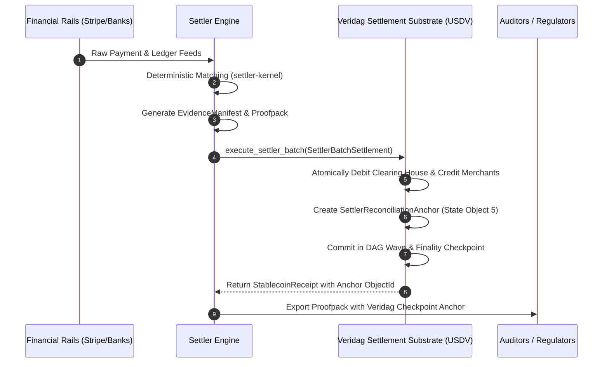

# Settler Reconciliation & Settlement Integration

## Overview

[Settler](https://github.com/Hardonian/Settler) is the enterprise reconciliation intelligence and audit operating system in the Hardonian / AIAS sovereign stack. Settler ingests transactions from disparate financial sources (Stripe, Shopify, bank feeds, ERPs, PSPs, and TigerBeetle ledger), matches them deterministically, and produces cryptographic **Evidence Manifests** and **Proofpacks**.

**Veridag** serves as the **Sovereign Execution and Monetary Settlement Substrate** for Settler:
1. **Irrevocable Finality:** Veridag's DAG-BFT consensus wave commits provide zero-reorg, sub-100ms finality for Settler's adjudicated payouts.
2. **Deterministic Settlement:** Disbursing USDV (or wrapped BTC/ETH) directly to merchant, provider, or partner accounts on Veridag based on Settler reconciliation runs.
3. **On-Chain Audit Anchors:** Every reconciliation proofpack is anchored permanently in Veridag's state tree via `SettlerReconciliationAnchor` (`object_type::SETTLER_ANCHOR = 5`), producing an immutable link between off-chain financial data and on-chain monetary transfers.

---

## Architectural Workflow



---

## Integration Data Contracts

### 1. `SettlerReconciliationAnchor`

Stores the cryptographic identity of the reconciliation run:

```rust
pub struct SettlerReconciliationAnchor {
    /// Tenant identifier from Settler (UUID / 32 bytes).
    pub tenant_id: [u8; 32],
    /// Reconciled job or run identifier.
    pub run_id: [u8; 32],
    /// Merkle root or SHA-256 hash of the Settler EvidenceManifest.
    pub manifest_hash: [u8; 32],
    /// Summary hash of variances and match adjudications.
    pub variance_summary_hash: [u8; 32],
    /// Total settlement volume in micro-units (6 decimals).
    pub total_settled_micro_units: u128,
    /// Number of transactions reconciled in this run.
    pub transaction_count: u64,
    /// Unix timestamp of reconciliation completion.
    pub timestamp: u64,
}
```

### 2. `SettlerBatchSettlement`

Executes multi-party disbursements atomically:

```rust
pub struct SettlerBatchSettlement {
    /// The anchor documenting the reconciliation run.
    pub anchor: SettlerReconciliationAnchor,
    /// Funding account (e.g. marketplace clearing or escrow account).
    pub source_account: Address,
    /// List of itemized payouts.
    pub payouts: Vec<SettlerPayoutItem>,
}
```

---

## CLI & Operator Usage

Reconciliation runs can be settled directly from Settler worker daemons or the command line:

```bash
# Settle a completed Settler reconciliation run on Veridag
veridag usdv settle \
  --tenant "0x5555...5555" \
  --run-id "0x9999...9999" \
  --manifest-hash "0xaaaa...aaaa" \
  --batch-file "./settler_recon_payouts.json"

# Verify the on-chain anchor of a Settler proofpack
veridag usdv verify-anchor --anchor-id "0xbbbb...bbbb"
```
